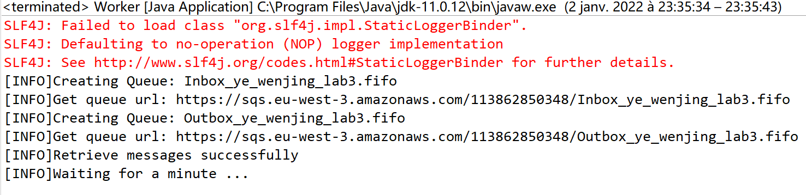
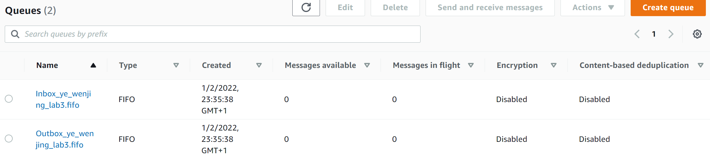
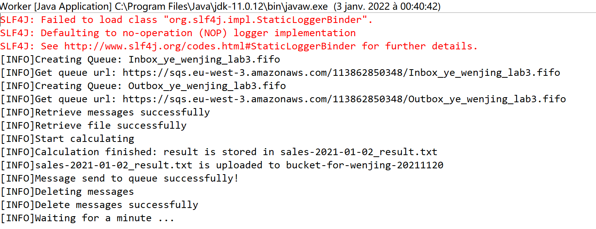
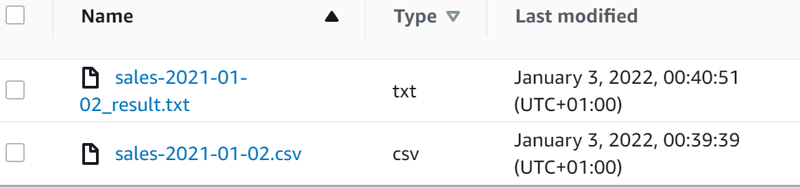
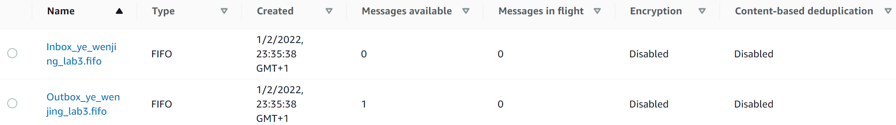
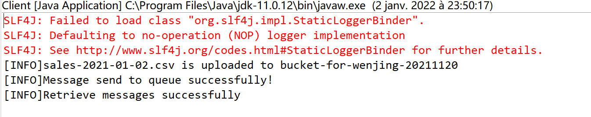
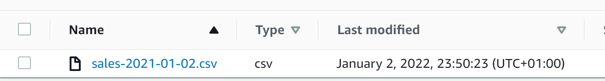
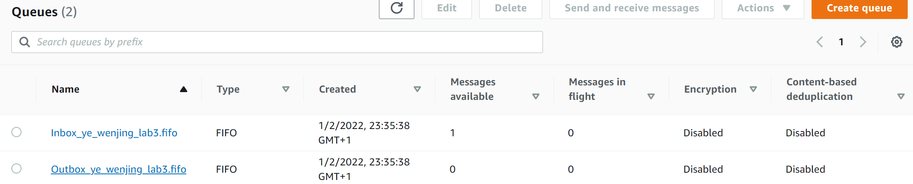
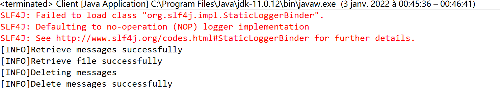
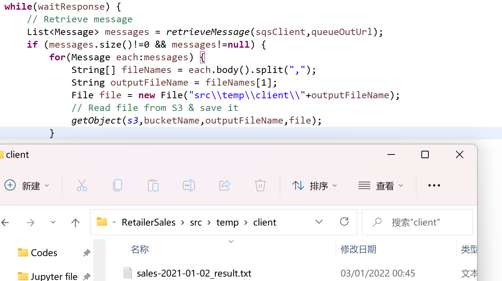

# LAB#3

YE Wenjing  (2021-2022 Major info)


## Object

automate the summarization of the hourly sales of a retailer with an application based on the *Web-Queue-Worker* architecture ([Microsoft, 2021](https://docs.microsoft.com/en-us/azure/architecture/guide/architecture-styles/web-queue-worker)) in a Cloud environment


### Two main components of the application

|       | Client                                                       | Worker                                                       |
| ----- | ------------------------------------------------------------ | ------------------------------------------------------------ |
| Def   | web front end that serves client requests                    | performs resource-intensive tasks, long-running workflows, or batch jobs |
| Task1 | reading the CSV file & upload it into the cloud              | wait for a message from the *Client*                         |
| Task2 | send a message to the *Worker* signaling that there is a file ready to be processed | once the message is received with the name of the file to process, read the file |
| Task3 | wait until it receives a message from the *Worker* that the summarization was completed | calculate (a) the **Total Number of Sales**, (b) the **Total Amount Sold** and (c) the **Average Sold** per country and per product |
| Task4 | download the resulting file                                  | write a file in the cloud, and send a message with the name of the file to the Client |
| Task5 |                                                              | wait for another message                                     |


### Specifications

> <u>Q1:  What type of queues can you create? State their differences</u>
>
> There are two types of Amazon SQS queues: **first-in, first-out (FIFO)** and **standard queues**. 
>
> - In FIFO queues: message strings remain in the same order in which the original messages were sent and received
> - Standard queues : keep message strings in the same order in which the messages were originally sent, but processing requirements may change the original order or sequence of messages
>
> So in our case, it would be better to use <u>FIFO queues</u>.


> <u>Q2: In which situations is a Web-Queue-Worker architecture relevant?</u>
>
> This architecture is commonly used for :
>
> - Applications with a relatively simple domain
> - Applications with some long-running workflows or batch operations
> - When you want to use managed services, rather than infrastructure as a service (IaaS)


## Result

### (1) Worker

<u>**Run for the first time**</u> (no message in queue right now) :  



> Code for creating a FIFO queue:
>
> ```java
> //Set attribute
>     		Map<QueueAttributeName, String> queueAttributes = new HashMap<>();
>             queueAttributes.put(QueueAttributeName.FIFO_QUEUE, "true");
>             
>             CreateQueueRequest createQueueRequest = CreateQueueRequest.builder()
>                 .queueName(queueName+".fifo")
>                 .attributes(queueAttributes)
>                 .build();
> 
> ```

- create 2 fifo queues:

  


**<u>Run for the 2nd time</u>** : retrieve message from Inbox queue (then delete it) + calculate + upload result file + send message to Outbox queue



- upload result file to s3

  


- message sent to Outbox queue

  


### (2) Client

<u>**Run for the 1st time**</u> : Load csv to S3 + send message to Inbox queue



- csv file uploaded to S3 bucket:

  

- message sent to queue: 

  


**<u>Run for the 2nd time</u>**: read message from Outbox queue  (then delete it) + save file to local 



- file saved in local

